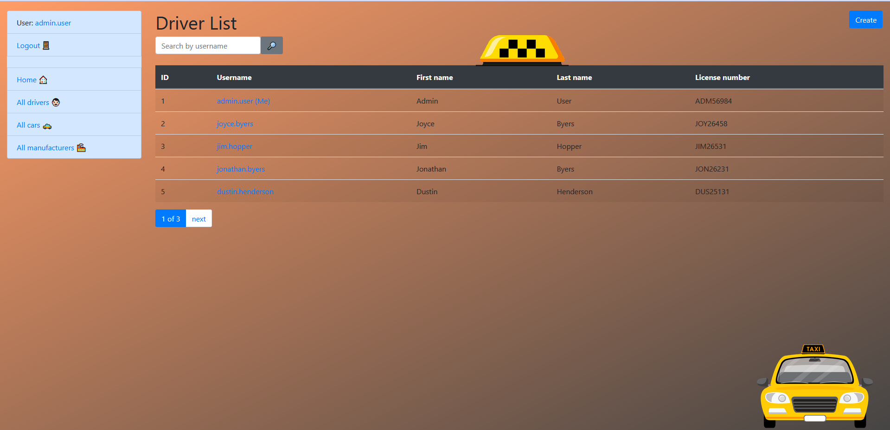

# Taxi service project

Django project for managing cars and drivers is taxi service

# Check it out!

[Taxi service project deployed to Heroku](https://taxi-service-mm.herokuapp.com/)

Test account:

* username: test123

* password: ZqggNJB896dgcaR

## Features

* Authentication functionality for Driver/User
* Managing cars and drivers directly from website
* Changed admin page for comfortable managing

## Demo



## Installation

Python3 must be already installed


```shell
git clone https://github.com/yaroslav-demchenko/taxi-service
cd taxi-service
python3 -m venv venv
source venv/bin/activate
pip install -r requirements.txt
python manage.py runserver # starts Django server
```
